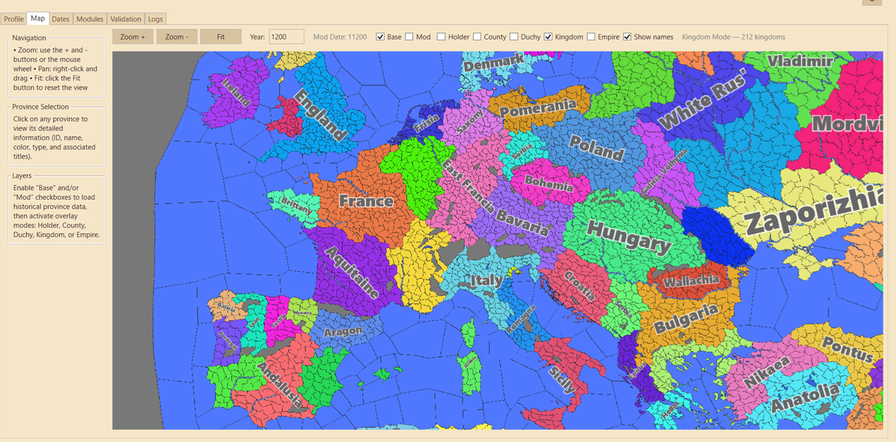

# PdxModIDE

---

**Desktop IDE for managing and processing Paradox Interactive game mods (CK3, EU4, HOI4, etc.)**
WPF application (.NET 8) that automates copying game files to the mod directory, applies year offsets, and validates differences.

**Current version:** 1.7.1

### Documentation

- **[PROJECT_CONTEXT.md](PROJECT_CONTEXT.md)** — Full technical context: architecture, data model, key modules, conventions, technical debt, and quick references.
- **Changelog** — Version history and changes (Keep a Changelog format), one file per minor version:
  - [1.7.x](Changelog/Changelog_v1_7_x.md)
  - [1.6.x](Changelog/Changelog_v1_6_x.md)
  - [1.5.x](Changelog/Changelog_v1_5_x.md)
  - [1.4.x](Changelog/Changelog_v1_4_x.md)
  - [1.3.x](Changelog/Changelog_v1_3_x.md)
  - [1.2.x](Changelog/Changelog_v1_2_x.md)
  - [1.1.x](Changelog/Changelog_v1_1_x.md)
  - [1.0.x](Changelog/Changelog_v1_0_x.md)
  - [Template](Changelog/Changelog_template.md)

### Setup & Build

```bash
# Build (Debug)
dotnet build PdxModIDE.sln --configuration Debug

# Build (Release)
dotnet build PdxModIDE.sln --configuration Release

# Run
dotnet run --project PdxModIDE.UI/PdxModIDE.UI.csproj
```

**Requirements**: .NET 8 SDK, Windows 10/11, a Paradox game installed (CK3 by default).

---

## Screenshots

